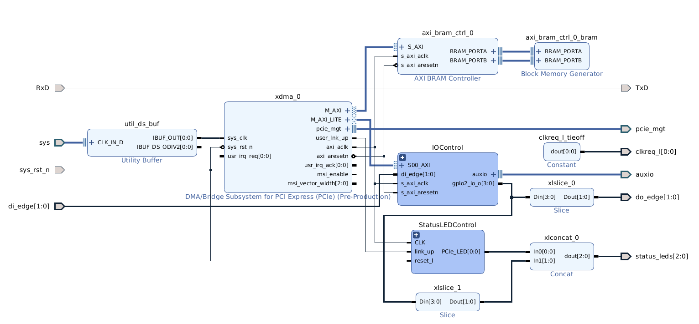

## This sample project demonstrates:
 - DMA transfer between block ram on FPGA and host PC, using PCIe x1, gen 2 (500MB/s)
 - Control LEDs on PicoEVB
 - Read/Control digital I/O on PicoEVB aux I/O connector
 - Read/Control digital I/O on PicoEVB PCIe edge connector

## Prerequisites:
 - This project uses Xilinx host-side DMA driver, so the driver must be installed and loaded.
See Xilinx [answer record 65444](https://www.xilinx.com/support/answers/65444.html) to download and install the driver.
If you are using Ubuntu 17.10 (or another distro with a recent kernel), use the version hosted [here](https://github.com/RHSResearchLLC/XilinxAR65444/tree/master/Linux). 
It has a bug fix (the latest version on the Xilinx website won't compile as of 09/28/2017)
 - Python 3

## Project details

Here is the Vivado block diagram that implements the project. The heavy lifting is done by Xilinx DMA/Bridge subsystem:

The 'B' LED indicates PCIe status:

| 'B' LED state | Meaning      |
| ---           | ---          |
|  Blinking     | PCIe link up |
|  Solid        | PCIe link in reset |
|  Off          | PCIe link failure |

### I/O map
When using the Xilinx XDMA driver, all communication between the FPGA and host SW happens via file read/writes.
To access the resources below, read/write to a device file (/dev/xdma0_user) at the given address:

| Address| Byte Length | Type | Description |
|  ---   |   ---       | ---  |      ---    |
| 0x0000 |  4          | R    | Version number     |
| 0x0008 |  4          | RW   | `aux IO pin` data    |
| 0x000C |  4          | RW   | `aux IO pin` direction   0=output, 1=input |
| 0x1000 |  4          | RW   | `PCIe digital input` data  |
| 0x100C |  4          | RW   | `PCIe digital input` direction   0=output, 1=input   **SHOULD BE INPUTS PER M.2 SPEC** |
| 0x1008 |  4          | RW   | `LEDs` |
| 0x100C |  4          | RW   | direction register for above   0=output, 1=input   Must be set to 0 to control LEDs |

### Register details

`aux IO pin` data & direction registers:

| D31-D4 | D3    | D2    | D1    | D0    |
| ---    | ---   | ---   | ---   | ---   |
| unused | Pin 5 | Pin 4 | Pin 2 | Pin 1 |

`PCIe digital input` register (see the schematic for pinout of W_DISABLE_1, W_DISABLE_2):

| D31-D2 | D1    | D0    |
| ---    | ---   | ---   |
| unused |  W_DISABLE_2 | W_DISABLE_1 |

`LEDs` register (see the schematic for pinout of M2_LED_1, M2_LED_2):

| D31-D4 | D3 | D2 | D1 | D0 |
| ---    | ---| ---| ---| ---|
| unused | LED A | LED C | M2_LED_1 | M2_LED_2 |

### Running the programs

 - A sample program to blink all LEDs: Host/blink-leds.py
 - A sample program that transfers some data to/from the block ram on the FPGA: Host/dma-test.py
 - With the Xilinx xdma driver loaded, simply run the python script

Both of these are python3 programs- they won't work properly with Python2

### Modifying the FPGA
See the readme in the FPGA folder for more information
